# MyDiary UI — Design Phases & Screenshot Reference

**Purpose:** Single source of truth for restyling the Expo diary app to match the MyDiary-inspired design you provided.  
**Location:** `docs/design/DIARY_UI_PHASES.md`  
**Screenshots:** `docs/design/screenshots/`

---

## Agent rules (always follow)

1. **Open this file first** before any UI redesign work.
2. Implement **one phase at a time**, in order, unless the user explicitly names a phase.
3. Preserve existing **backend contracts**: timed logs, calendar markers, search favorites, GridFS photos, wired Render API (`mobile/lib/env.ts`). Do not reintroduce in-app API key fields.
4. Out of scope unless asked later: real PRO billing, ads, social “Follow Us”, third-party backup vendors. Menu rows may appear as **stubs**.
5. Prefer screenshots embedded in this doc over memory when layout is ambiguous.

---

## 0. Product principles (from the reference UI)

| Principle | Detail |
|-----------|--------|
| App name | **MyDiary** (UI brand; code folder can stay `mobile`) |
| Default look | Dark navy shell: bg ~`#0A1220`–`#0F203D`, white primary text, muted blue secondary text, accent blue ~`#4A90E2` |
| Primary action | Large circular **+ FAB** (center of bottom nav or floating on calendar) |
| Bottom nav | **Calendar** (left) · **+** (center FAB) · **Mine / profile** (right) |
| Secondary tools | Left **drawer** (hamburger): Theme, Tags, Diary Lock, Backup, Export, Help… |
| Themes | First-class gallery: tabs **HOT / DARK / LIGHT**, 3-column previews, **APPLY** / selected check |
| Diary core (keep) | Multi **timed logs** per calendar day (device time on save), photos, mood, tags, On This Day |
| Settings | Grouped lists + toggles; **Diary Lock → local PIN**; no API credentials UI |

### Color tokens (baseline dark theme)

```
bg          #0B162C
bgElevated  #16223E
text        #FFFFFF
textMuted   #8BA3C7 / #5A7B9A
accent      #4A90E2
fab         #3B82F6 (theme-overridable)
danger      #E05A5A
favorite    #FFC857
```

Themes later swap `bg`, illustration header, `fab` / accent only — shell structure stays same.

---

## 1. Current app → target shell

| Current (today) | Target |
|-----------------|--------|
| Tabs: Home / Calendar / Search / Settings | **Home** (themed) + bottom **Calendar \| + \| Mine**; Search in header; Settings via drawer/gear |
| Light “paper journal” greens | Dark navy + **theme pack** (default night mountain) |
| Day screen = long form | **Entry editor**: big date, mood chip, SAVE, timeline logs, bottom tool strip |
| Settings = PIN + connection test | Settings lists (General / Preferences / Time / About); connection stays code-wired |

---

## 2. Build phases (order of implementation)

### Phase 1 — Design system foundation

**Goal:** Theme tokens + provider so every later screen can consume colors/fonts/radius.

**Implement**
- [x] `constants/theme.ts` (or theme packages) with dark baseline tokens above
- [x] `ThemeContext`: `themeId`, `tokens`, persistence via AsyncStorage
- [x] Global font scaling / display vs body (sans for MyDiary chrome; keep current fonts or move to clean sans for chrome only)
- [x] Shared primitives: `Screen`, `Card`, `ListRow`, `SectionHeader`, `PrimaryButton`, `FAB`

**Screenshots**
- All theme previews (chrome color language): `05`, `07`, `11`, `16`, `18`, `20`, `21`

**Done when:** App still works with old screens but can wrap in dark `bg` tokens.

---

### Phase 2 — App shell & navigation

**Goal:** Drawer + bottom bar with FAB; remove 4-tab dashboard feel.

**Implement**
- [x] Root layout: drawer (or custom slide menu) + stack (`(main)` + stack screens)
- [x] Bottom bar: Calendar | **FAB** | Mine  
  - FAB → open day for **today** (or last viewed date)
- [x] Header: hamburger (open drawer), **PRO** pill stub optional, **search** → Search screen
- [x] Drawer items (stubs OK): Theme, Tags, Diary Lock, Backup & Restore, Export & Import, Help  
  - **Diary Lock** → existing PIN flow  
  - **Theme** → Themes gallery route  
  - Gear on Mine → Settings

**Screenshots**
- Home chrome + bottom bar: `06-home-empty-cherish.png`
- Drawer: `08-drawer-menu.png`

**Done when:** Navigating Home / Calendar / Mine / Search / Drawer works without broken routes.

**Status:** Complete — shell in `mobile/app/(main)/`, custom `MainTabBar` + `AppDrawer` + `ShellHeader`; Search / Settings / Themes on root stack; old `(tabs)` removed.

---

### Phase 3 — Home (empty + filled)

**Goal:** Emotional home like reference empty state; later list recent memories.

**Implement**
- [x] Full-bleed night landscape background (static asset or gradient + stars + mountains; house glow optional)
- [x] Empty card: scrapbook illustration area + **“Cherish every moment.”** + “Tap to start…” → FAB/today
- [x] Filled state: reuse API `listEntries` / On This Day / streak under same shell (not freeform marketing spam)

**Screenshots**
- `06-home-empty-cherish.png`

**Status:** Complete — `NightLandscape` + `CherishMomentCard` on home; empty centered bubble; filled hero + streak / On This Day / Recent panels.

---

### Phase 4 — Calendar

**Goal:** Calendar matches reference calendar screens.

**Implement**
- [x] Title “Calendar”; month name + dropdown; gallery shortcut icon
- [x] Month grid; selected day = filled blue circle
- [x] Below: “Monday , Aug 03 , 2026” style strip
- [x] Empty: “No diaries on this day. Write now!”
- [x] Filled: list of entries/logs preview for selected day (existing markers + entry fetch)
- [x] FAB center bottom (shell `MainTabBar`)

**Screenshots**
- Empty: `14-calendar-empty-fab.png`
- With content: `04-calendar-with-entries.png`

**Status:** Complete — selection panel + month jump + month photo days gallery; keeps markers API.

---

### Phase 5 — Day / entry editor

**Goal:** Writing UX like reference editor + keep timed multi-logs.

**Implement**
- [x] Header: back · · · · **SAVE** (blue button)
- [x] Date header: large day number + month/year + chevron (date switcher)
- [x] Mood badge (tappable) → mood sheet
- [x] Title + body draft area  
- [x] **Timeline of timed logs** (time left/top, text below) — product feature already on API  
- [x] Save log with **device system time** (and optional time edit via picker)
- [x] Bottom tool strip: background, **gallery/photos**, favorite, emoji/mood, type, list, tags, mic stub
- [x] DateTime picker modal for choosing log time when needed
- [x] Mood sheet: “How's your day?” + emoji grid

**Screenshots**
- Multi-log day (current product UX reference): `01-day-logs-timeline.png`, `02-day-logs-alt.png`
- DateTime picker: `03-datetime-picker.png`
- Editor chrome: `10-entry-editor-save.png`
- Mood sheet: `17-mood-picker-sheet.png`

**Status:** Complete — themed day editor + MoodSheet + DateTimePicker + EditorToolStrip; multi-log SAVE at device/custom time.

---

### Phase 6 — Mine (profile)

**Goal:** Profile / stats hub.

**Implement**
- [x] Header Mine + gear → Settings
- [x] Sign-in stub row (“Each day provides…”)
- [x] Optional promo / habit cards as lightweight stubs (no billing)
- [x] Stats card: diary count from API `stats`, quote area, share stub
- [x] Prompt card → start writing today
- [x] Achievements row (decorative stubs OK)
- [x] Mood statistics strip (from entries moods if available)

**Screenshots**
- `13-mine-profile.png`
- `09-mine-stats-achievements.png`

**Status:** Complete — Mine hub with PRO/habit stubs, stats landscape card, achievements, week circles, mood bars.

---

### Phase 7 — Themes gallery

**Goal:** HOT / DARK / LIGHT grid; APPLY updates global theme.

**Implement**
- [x] Screen title Themes + back
- [x] Tabs HOT | DARK | LIGHT
- [x] 3-column cards: header illustration + mock UI skeleton + themed FAB color
- [x] APPLY / selected checkmark
- [x] FREE badges where listed
- [x] Theme list as static data module (id, category, colors, optional image require)

**Screenshots**
- `05-themes-hot-grid-a.png`
- `07-themes-hot-grid-b.png`
- `11-themes-hot-grid-c.png`
- `16-themes-light-grid.png`
- `18-themes-hot-grid-d.png`
- `20-themes-selected-apply.png`
- `21-themes-hot-grid-e.png`

**Status:** Complete — `themeCatalog.ts` (20 packs), 3-col `ThemePreviewCard`, APPLY persists via ThemeContext.

---

### Phase 8 — Settings

**Goal:** Dark settings lists matching reference; PIN + preferences only (no API keys).

**Implement**
- [x] General section: Mood Style, Tags, Diary Lock, Theme, Export stub, Notification stub…
- [x] Diary Preferences: toggles for Display Mood on Calendar, Show On This Day, etc. (persist AsyncStorage)
- [x] Time Options: first day of week, date format, time format (display prefs)
- [x] About: version, placeholders for policy/help
- [x] **Diary Lock** → existing PIN enable/disable

**Screenshots**
- `12-settings-general.png`
- `15-settings-diary-prefs.png`
- `19-settings-time-about.png`

**Status:** Complete — PreferencesContext + full Settings lists; live prefs on Home (OTD), Calendar (first day + mood strip), Day (mood hint + time format).

---

### Phase 9 — Polish

**Goal:** Ship-quality edges.

**Implement**
- [x] Photo full-screen viewer styles match dark shell
- [x] Empty/loading/error states; Render cold-start messaging if needed
- [x] Calendar gallery entry point (all photos) if time allows
- [x] Motion: tab underlines, FAB press, theme apply fade
- [x] Regression: logs, photos, search, cherish, on-this-day

**Status:** Complete — themed photo viewer, gallery route, StateViews + friendlyApiMessage, tab underline + theme flash + FAB/theme press; EntryCard/PhotoGrid themed.

---

## 3. Phase → screenshot index

| Phase | Screenshot files |
|-------|------------------|
| 1 Tokens | `05`, `07`, `11`, `16`, `18`, `20`, `21` |
| 2 Shell | `06`, `08` |
| 3 Home | `06` |
| 4 Calendar | `04`, `14` |
| 5 Entry / logs | `01`, `02`, `03`, `10`, `17` |
| 6 Mine | `09`, `13` |
| 7 Themes | `05`, `07`, `11`, `16`, `18`, `20`, `21` |
| 8 Settings | `12`, `15`, `19` |

---

## 4. Screenshot inventory (full gallery)

Each entry: stable file, screen name, phase, key elements, embed.

### `01-day-logs-timeline.png` — Day logs timeline · **Phase 5**

**Key elements:** Multiple logs on one day; each shows **system time** + body text; date header; save log behavior.

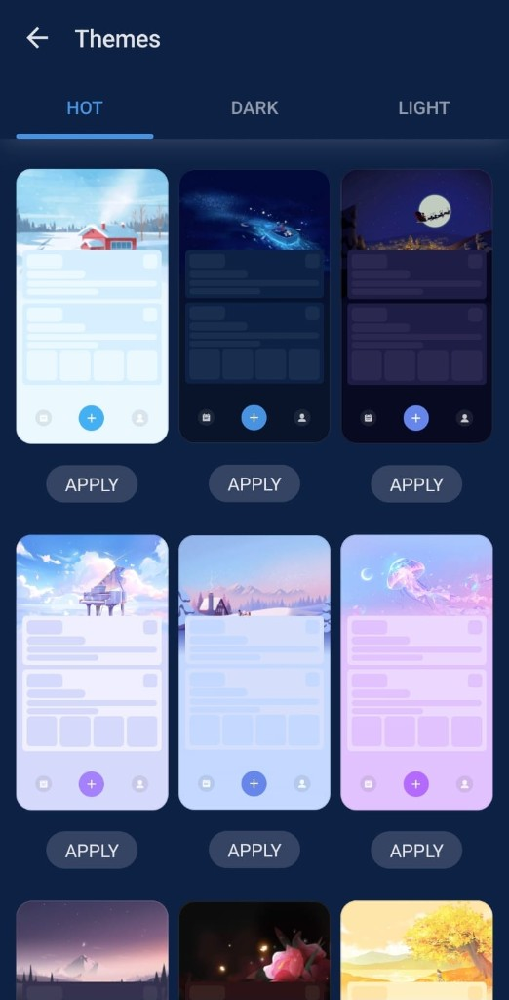

---

### `02-day-logs-alt.png` — Day logs (alternate state) · **Phase 5**

**Key elements:** Same timeline pattern; confirms multi-save UX for one calendar date.

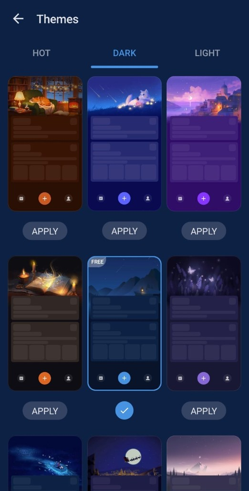

---

### `03-datetime-picker.png` — Date & time picker · **Phase 5**

**Key elements:** Modal “Time & Date”; day/hour/min wheels; cancel/confirm; used when editing log time or picking entry datetime.

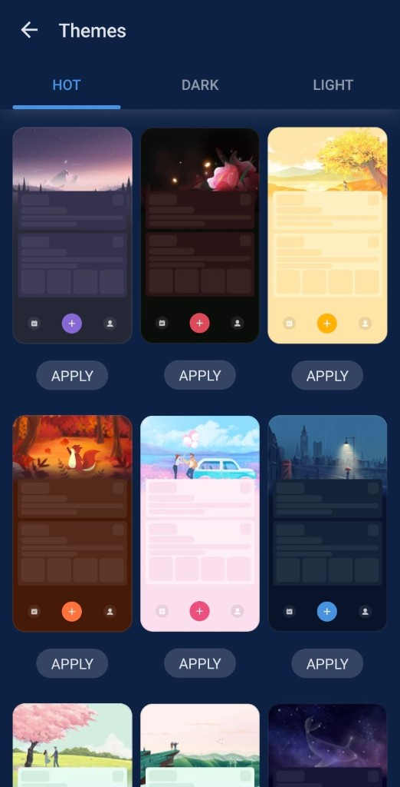

---

### `04-calendar-with-entries.png` — Calendar with day list · **Phase 4**

**Key elements:** Month grid with selection; lower panel lists diaries for selected day (previews/times).

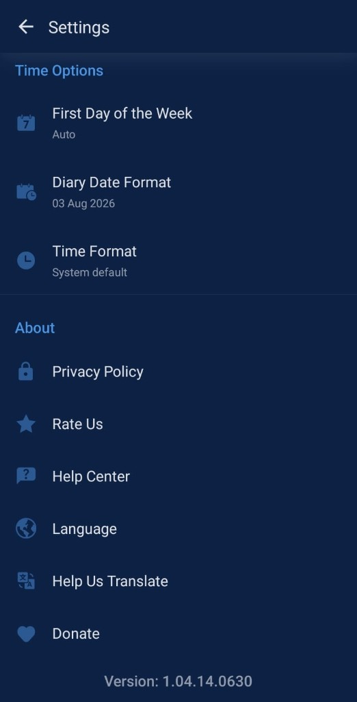

---

### `05-themes-hot-grid-a.png` — Themes · HOT grid A · **Phase 7 / 1**

**Key elements:** HOT tab underline; 3-col previews; FREE tags; APPLY buttons; themed center FAB in mock.

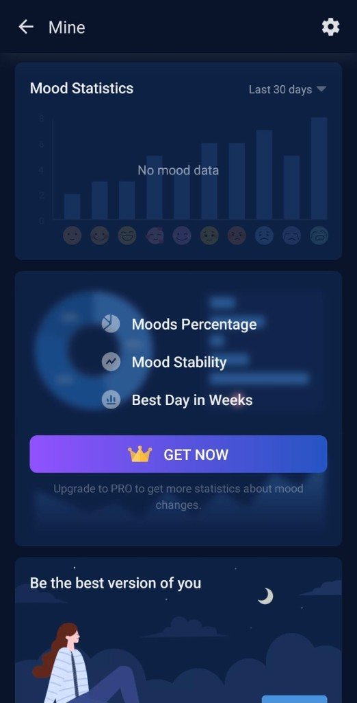

---

### `06-home-empty-cherish.png` — Home empty state · **Phase 2 / 3**

**Key elements:** Night sky + mountains + house; hamburger / PRO / search; bubble card “Cherish every moment.”; bottom nav with center FAB.

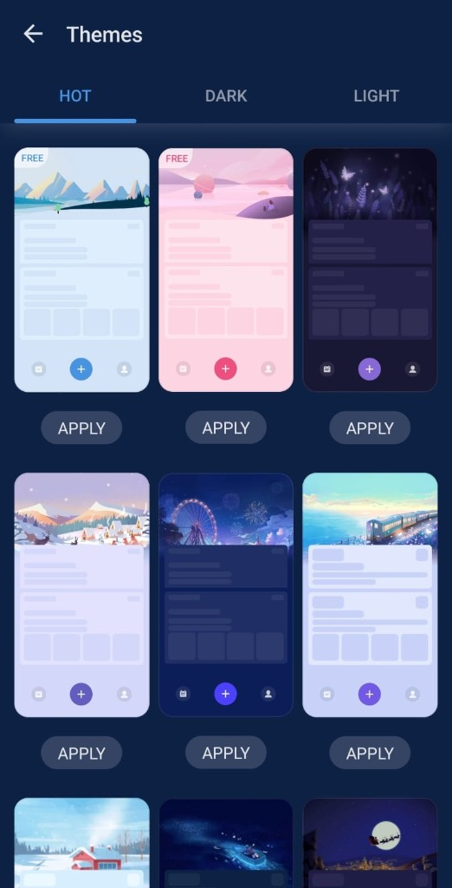

---

### `07-themes-hot-grid-b.png` — Themes · HOT grid B · **Phase 7**

**Key elements:** Additional HOT themes; same apply interaction.


---

### `08-drawer-menu.png` — Side drawer · **Phase 2**

**Key elements:** MyDiary header + book art; sections: Upgrade stub, Theme, Tags, Diary Lock, Backup, Export, Donate/Share stubs, Help.

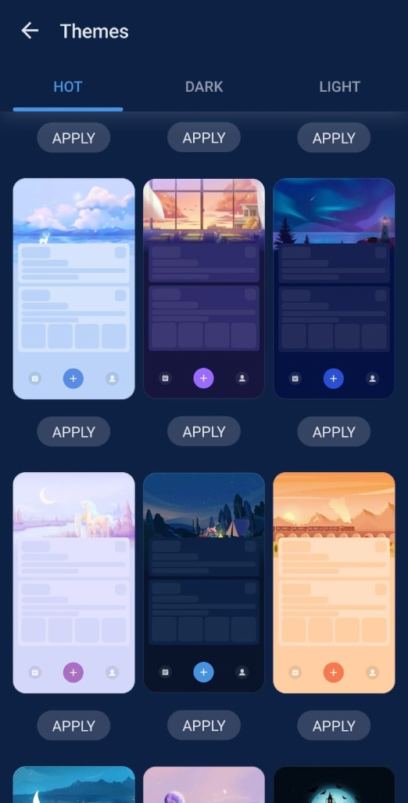

---

### `09-mine-stats-achievements.png` — Mine · achievements & weekly stats · **Phase 6**

**Key elements:** GET NOW promo; achievements badges; Diary Statistics week circles.

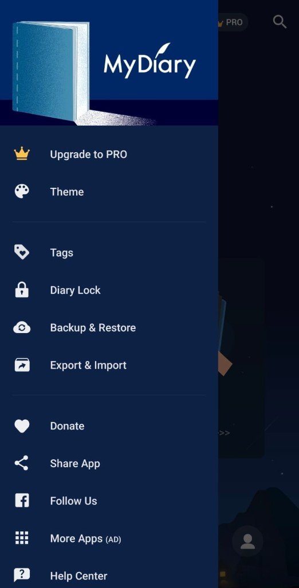

---

### `10-entry-editor-save.png` — Entry editor chrome · **Phase 5**

**Key elements:** Back, overflow, blue SAVE; date + mood; Title / Write placeholders; bottom 8-icon toolbar.

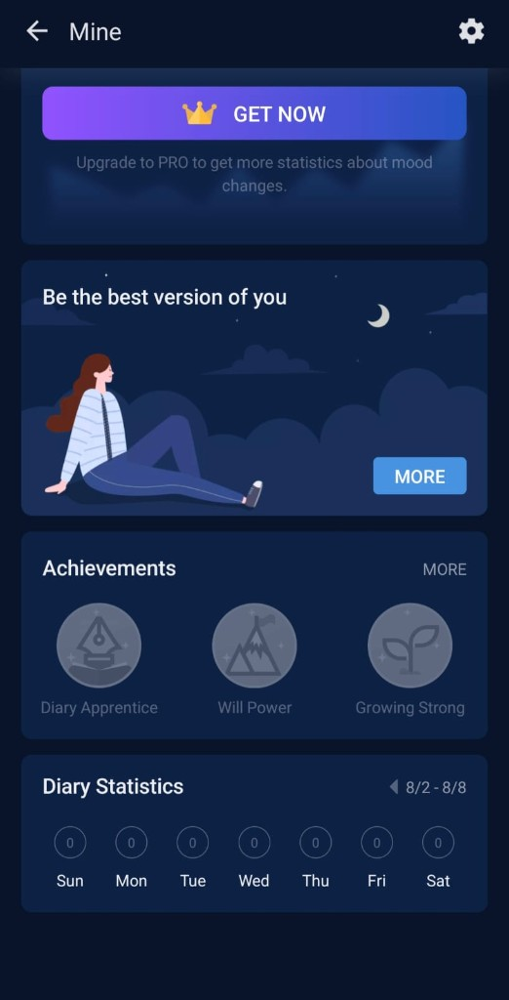

---

### `11-themes-hot-grid-c.png` — Themes · HOT grid C · **Phase 7**

**Key elements:** More HOT previews; compact card styling reference.

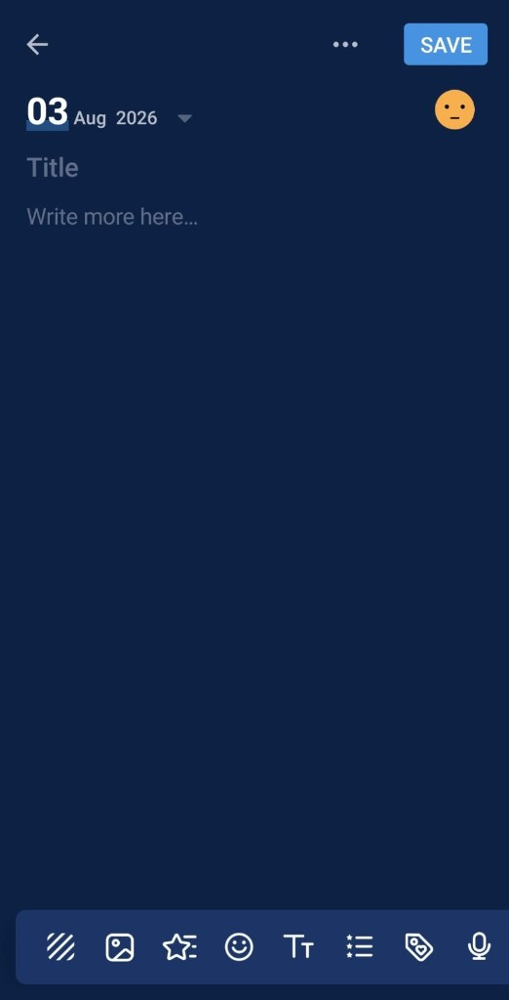

---

### `12-settings-general.png` — Settings · General · **Phase 8**

**Key elements:** List rows (icon + title + chevron): Mood Style, Tags, Diary Lock, Theme, Backup, Export… Section headers in light blue.

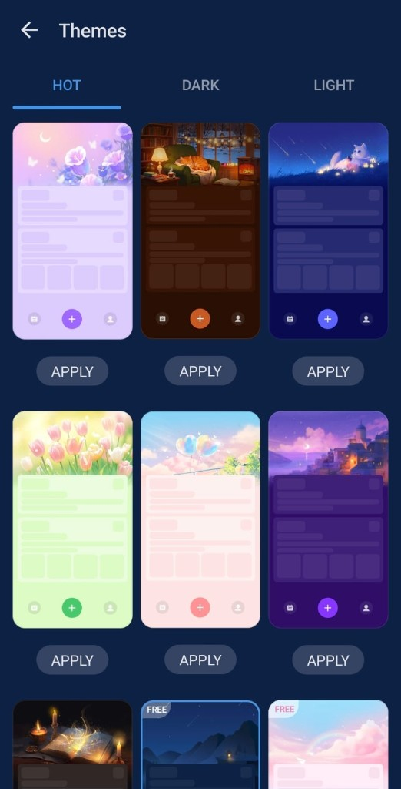

---

### `13-mine-profile.png` — Mine · profile hub · **Phase 6**

**Key elements:** Sign in stub; promo cards; diary count hero; write prompt + START; mood statistics header.

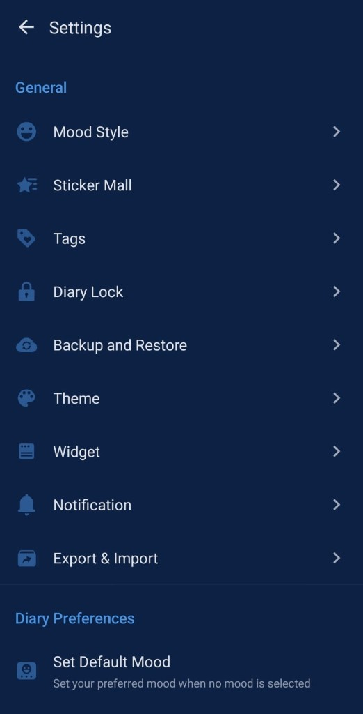

---

### `14-calendar-empty-fab.png` — Calendar empty day · **Phase 4**

**Key elements:** AUGUST 2026 header; selected day circle; empty copy; center FAB.

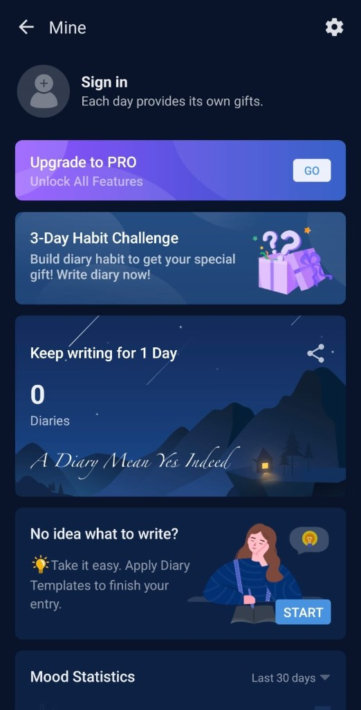

---

### `15-settings-diary-prefs.png` — Settings · Diary Preferences · **Phase 8**

**Key elements:** Toggles: default mood helper text, display mood on calendar, image time, keep background/template, show On This Day.

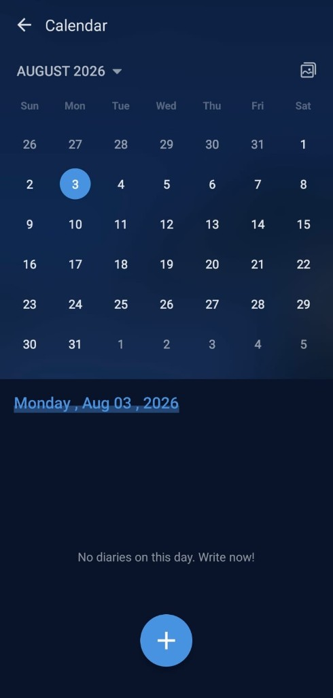

---

### `16-themes-light-grid.png` — Themes · LIGHT tab · **Phase 7**

**Key elements:** LIGHT tab selected; pastel previews; FREE badges; APPLY.

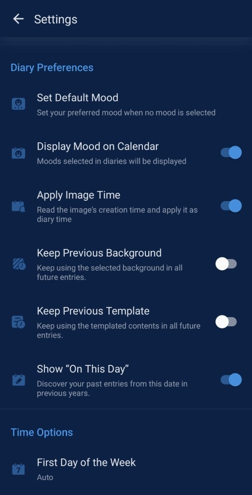

---

### `17-mood-picker-sheet.png` — Mood picker sheet · **Phase 5**

**Key elements:** Overlay “How's your day?”; 2×5 emoji moods; MORE link; ties to editor toolbar smiley.

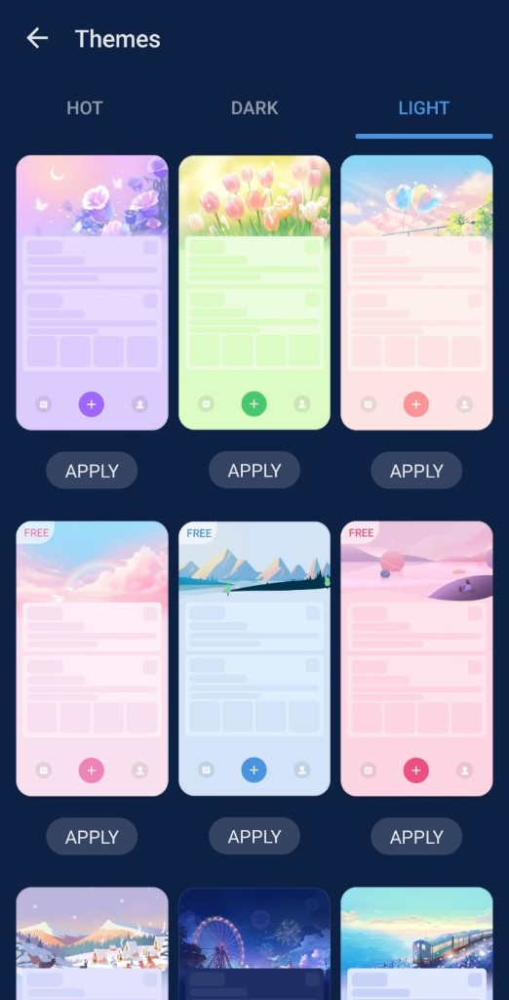

---

### `18-themes-hot-grid-d.png` — Themes · HOT grid D · **Phase 7**

**Key elements:** Nature / celestial HOT packs; FAB color variety.

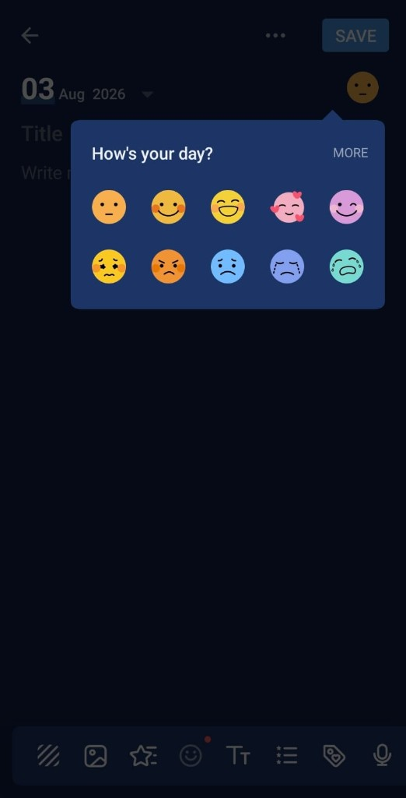

---

### `19-settings-time-about.png` — Settings · Time Options & About · **Phase 8**

**Key elements:** First day of week, diary date format, time format; About links; app version footer.

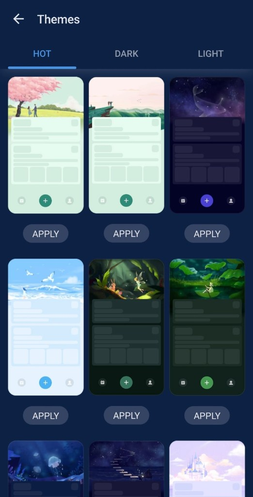

---

### `20-themes-selected-apply.png` — Themes · selection state · **Phase 7**

**Key elements:** Selected theme **blue border** + check FAB instead of APPLY; FREE tag; how “current theme” is shown.

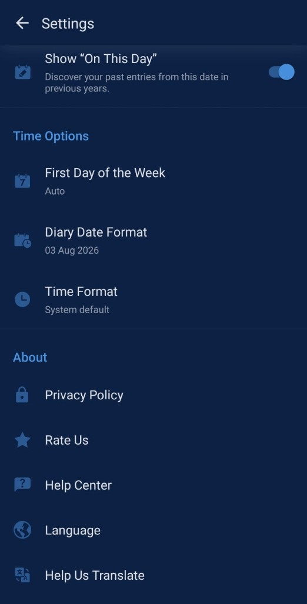

---

### `21-themes-hot-grid-e.png` — Themes · HOT grid E · **Phase 7**

**Key elements:** Extra HOT pack coverage for variety in theme data module.

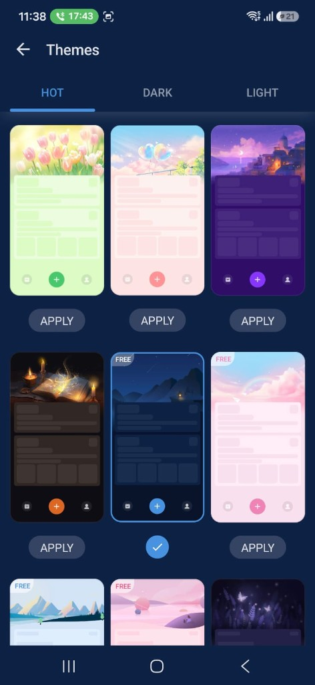

---

## 5. Suggested route map (target)

```
app/
  _layout.tsx              # providers + drawer shell
  (main)/
    _layout.tsx            # bottom Calendar | FAB | Mine
    index.tsx              # Home (Phase 3)
    calendar.tsx           # Phase 4
    mine.tsx               # Phase 6
  search.tsx               # keep search (header entry)
  day/[date].tsx           # Phase 5
  photo/[id].tsx
  themes.tsx               # Phase 7
  settings.tsx             # Phase 8
  drawer content           # Phase 2
```

Exact folder names may match Expo Router conventions as long as IA above is honored.

---

## 6. Non-goals / stubs

| UI copy | Implementation policy |
|---------|----------------------|
| Upgrade to PRO / GET NOW | Visual stub only |
| Donate / Follow Us / More Apps (AD) | Omit or dead-end “Coming soon” |
| Backup / Export cloud | Stub until designed; data already on Mongo/Render |
| Stickers / Templates mall | Stub or skip until Phase 9+ |
| Voice mic | Optional later |

---

## 7. How to use this doc when building

1. User: “Implement Phase N.”
2. Agent: re-read this section for Phase N + listed screenshots (open image files).
3. Match layout structure first (spacing, hierarchy), then polish (radii, opacities).
4. Re-run on Expo Go (SDK 54); keep API defaults from `mobile/lib/env.ts`.
5. When Phase N is complete, check boxes here in a follow-up commit if desired.

---

## 8. Status

| Item | Status |
|------|--------|
| Screenshots copied to `docs/design/screenshots/` | Done (21 files) |
| This phase document | Done |
| Phase 1 UI implementation | **Done** — tokens, ThemeContext, primitives, dark default chrome |
| Phase 2 UI implementation | **Done** — `(main)` shell, Calendar\|FAB\|Mine, drawer, stack Search/Settings/Themes |
| Phase 3 UI implementation | **Done** — night landscape home, Cherish card empty/filled |
| Phase 4 UI implementation | **Done** — calendar select day, date strip, empty/filled preview, month/gallery |
| Phase 5 UI implementation | **Done** — entry editor SAVE chrome, mood sheet, log time picker, tool strip |
| Phase 6 UI implementation | **Done** — Mine profile/stats hub, achievements, week + mood charts |
| Phase 7 UI implementation | **Done** — Themes gallery HOT/DARK/LIGHT, 20 packs, APPLY + FREE badges |
| Phase 8 UI implementation | **Done** — Settings lists, prefs AsyncStorage, Diary Lock PIN sheet |
| Phase 9 UI implementation | **Done** — polish: gallery, states, motion, photo viewer, cold-start copy |

### Phase 1 checklist

- [x] `constants/theme.ts` dark baseline + catalog packs
- [x] `ThemeContext` + AsyncStorage theme id
- [x] Shared primitives: Screen, Card, ListRow, SectionHeader, PrimaryButton, FAB, AppText
- [x] Root / tabs / PIN use themed chrome; legacy `colors.*` aliases map to dark tokens

### Phase 2 checklist

- [x] `app/(main)/` with custom header + tab bar + drawer
- [x] Bottom bar Calendar | FAB (today) | Mine
- [x] ShellHeader: hamburger, PRO stub, search
- [x] AppDrawer: Theme, Diary Lock, Settings, stubs
- [x] Stack: search, settings, themes; removed `(tabs)`

### Phase 3 checklist

- [x] `NightLandscape` full-bleed (stars, moon, mountains, house glow)
- [x] `CherishMomentCard` empty hero → today
- [x] Filled: compact cherish card + streak + On This Day + Recent over landscape

### Phase 4 checklist

- [x] Title Calendar + month dropdown + gallery shortcut
- [x] Selected day filled circle; markers for entries/favorites
- [x] Date strip `formatCalendarStrip`; empty / log preview panel
- [x] FAB remains center bottom (shell)

### Phase 5 checklist

- [x] Header back ··· · blue SAVE
- [x] Large date + switcher; mood badge → MoodSheet
- [x] Title + write draft; timed log timeline
- [x] Device time save + optional DateTimePicker
- [x] Bottom EditorToolStrip (photos, favorite, mood, tags…; mic stub)

### Phase 6 checklist

- [x] Header title Mine + gear → Settings
- [x] Sign-in stub + PRO / habit stubs
- [x] Stats card (API) + quote + share stub
- [x] Prompt START → today; achievements; week circles; mood bars

### Phase 7 checklist

- [x] `constants/themeCatalog.ts` static packs + illustration
- [x] 3-column ThemePreviewCard (illus + shell mock + FAB)
- [x] HOT | DARK | LIGHT tabs; APPLY / SELECTED; FREE badge
- [x] APPLY updates ThemeContext + AsyncStorage

### Phase 8 checklist

- [x] General list (stubs + Theme, Diary Lock)
- [x] Diary Preferences toggles (AsyncStorage)
- [x] Time Options (first day / date / time format)
- [x] About + version; Advanced connection test
- [x] Prefs wired: Home OTD, Calendar firstDay + mood, Day hint/time

### Phase 9 checklist

- [x] Photo viewer themed + load/error
- [x] `StateViews` + `friendlyApiMessage` (Render cold start)
- [x] `/gallery` all photos; calendar + drawer entry
- [x] Tab underline, FAB press, theme apply flash
- [x] EntryCard / PhotoGrid / search error polish